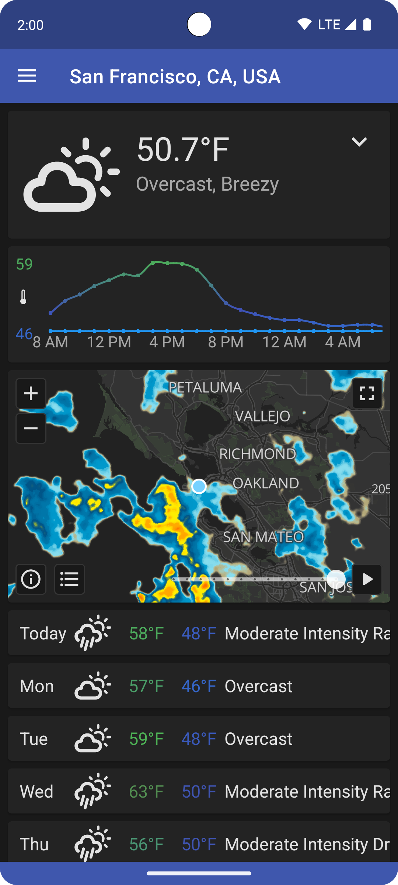
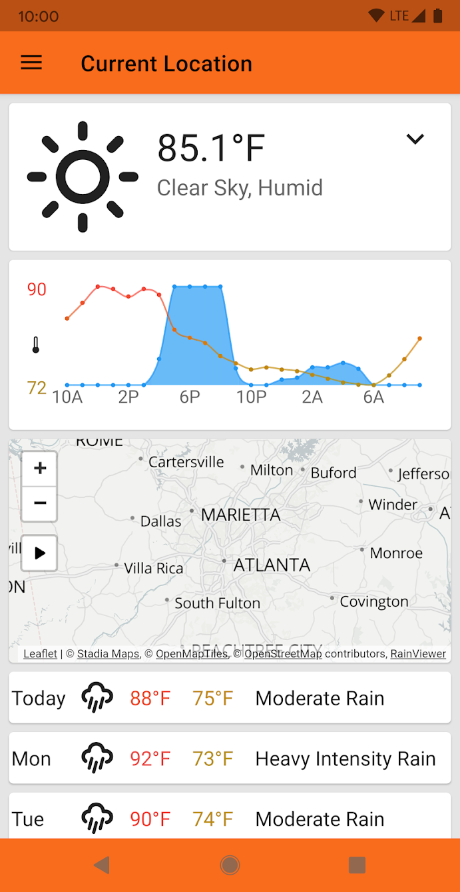
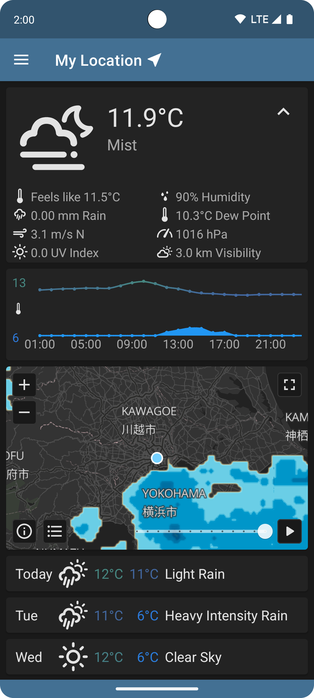
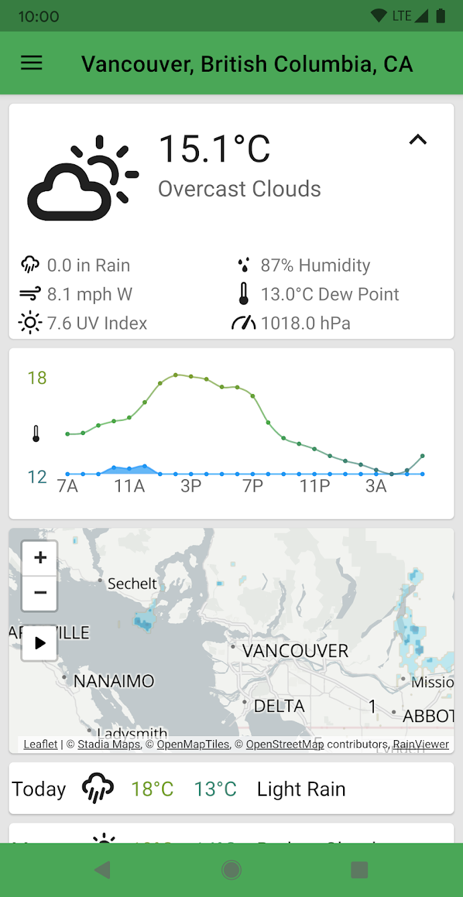
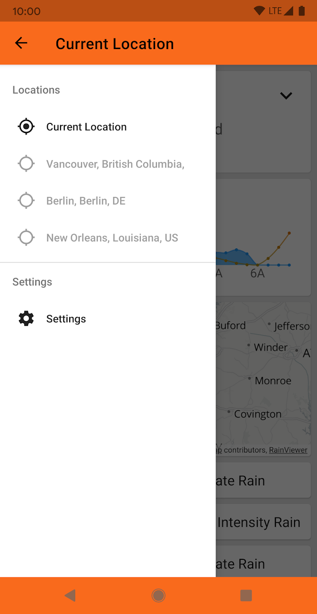

 QuickWeather
=================
[](https://opensource.org/licenses/)[]()

 Weather at a glance! Current and forecast weather for anywhere in the world!

[](https://f-droid.org/packages/com.ominous.quickweather/)
[](https://play.google.com/store/apps/details?id=com.ominous.quickweather)

Description
---
     

QuickWeather is really fast. Just open the app and see the weather right now. There's no loading screen and no wait time. The weather is delivered to you with no extra junk, just clean and clear information.

You can add as many locations to the side drawer as you want to have their weather a single tap away. QuickWeather can even determine your current location if you allow it (location information is not collected).

QuickWeather is Always Free (No IAPs or Ads) and Always Open Source

Here's what you get

* Fullscreen Radar
* Current Weather, Temperature, Precipitation, Wind Speed, Humidity, Pressure, Dew Point
* Current and Forecast Temperature and Precipitation Graph
* Current Weather Notification
* Weather Alert Notifications
* Hourly Temperature and Precipitation (48 hours)
* 3-Hour Temperature and Precipitation (5 days)
* Daily Forecast Weather and High and Low Temperature (7 days)
* Daily UV Index

QuickWeather is powered by <a href="https://openweathermap.org/">OpenWeatherMap.org</a> or <a href="https://open-meteo.com/">Open-Meteo</a>. 
* If using OpenWeatherMap, QuickWeather requires an active API key with the "One Call by Call" subscription to the "One Call 3.0" API to function. If you do not have one, you can sign up for a free API key <a href="https://home.openweathermap.org/subscriptions/unauth_subscribe/onecall_30/base">here</a>.
* If using Open-Meteo, QuickWeather does not require an API key.


Required Permissions
* **Internet** - Required to connect to the internet and retrieve weather information

Optional Permissions
* **Location** - Required to retrieve the user's current location, if requested
* **Background Location** - Required to retrieve the user's current location for weather notification and alerts, if requested
* **Receive Boot Completed** - Required to reschedule the notification service each boot

Translation
---
QuickWeather uses [Weblate](https://weblate.org/) for translations. If you would like to help translate QuickWeather into a language that you know, please contribute to the [Weblate project](https://hosted.weblate.org/projects/quickweather/).

License
---
```
    Copyright 2019 - 2024 Tyler Williamson

    This file is part of QuickWeather.

    QuickWeather is free software: you can redistribute it and/or modify
    it under the terms of the GNU General Public License as published by
    the Free Software Foundation, either version 3 of the License, or
    (at your option) any later version.

    QuickWeather is distributed in the hope that it will be useful,
    but WITHOUT ANY WARRANTY; without even the implied warranty of
    MERCHANTABILITY or FITNESS FOR A PARTICULAR PURPOSE.  See the
    GNU General Public License for more details.

    You should have received a copy of the GNU General Public License
    along with QuickWeather.  If not, see <https://www.gnu.org/licenses/>.
```
